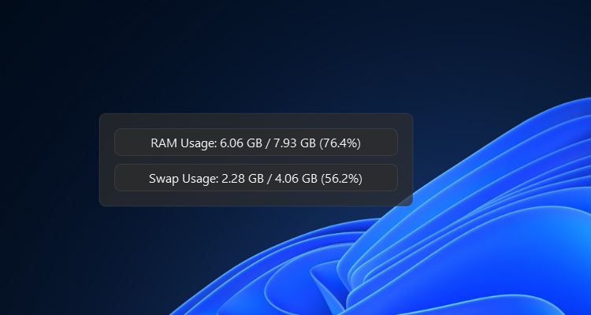
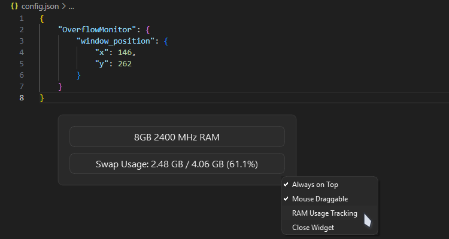

# OverflowMonitor

**A lightweight, customizable system monitor for tracking RAM and swap memory usage.**

## Features

- Displays current RAM and swap memory usage
- Option to track RAM usage dynamically
- Always-on-top mode for quick reference
- Draggable interface for easy positioning
- Configurable settings saved across sessions

## Preview




## Installation

- Download the [latest release]() from the repository.
- Run `OverflowMonitor.exe` on Windows.

## Usage

- Right-click on the widget to access the settings menu.
- Toggle "Always on Top" to keep the widget visible.
- Enable "Mouse Draggable" to move the widget freely.
- Turn on "RAM Usage Tracking" for real-time RAM stats.
- Close the widget anytime using the context menu.

## Configuration

Settings are saved automatically, including window position and user preferences. If needed, you can edit `config.json` manually to adjust values.

## Compatibility

- **Windows**: Uses `PowerShell` to retrieve RAM details
- **Linux**: Requires `dmidecode` for memory info
- **macOS**: Retrieves memory using `sysctl`

## Compiling for Linux & macOS

To create a standalone executable using PyInstaller, follow these steps:

1. Make sure python3 and pip are installed. If not, install them using your package manager (e.g., `sudo apt install python3 python3-pip`, or `brew install python3`).

2. Navigate to the project directory and run:

```bash
pip3 install -r requirements.txt
pip3 install pyinstaller
pyinstaller --onefile --windowed --icon qt_icon.ico --name OverflowMonitor main.py
```

- `--onefile`: Packages everything into a single executable
- `--windowed`: Ensures no terminal window appears
- `--name OverflowMonitor`: Names the output file

3. After the build process completes, the executable will be found inside the `dist/` folder.

4. Run the binary:

```bash
./dist/OverflowMonitor
```

## Notes

- On Linux, `sudo` might be needed to access memory information.
- If RAM speed is unknown, the widget will display approximate memory size.

Enjoy tracking your system stats effortlessly!
